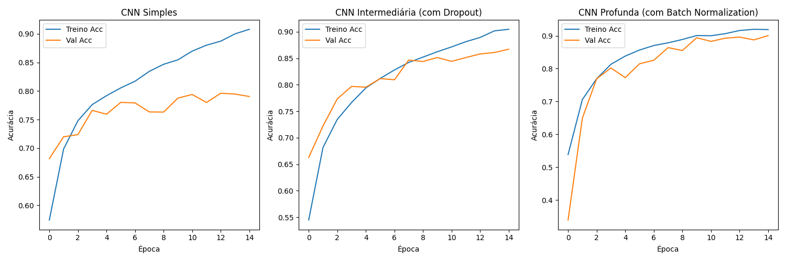

# Desafio Prático: Classificação de Imagens com CNN

## Objetivo
Adaptação e desenvolvimento de uma Rede Neural Convolucional (CNN) para classificação multiclasse de imagens coloridas (dataset CIFAR-10), limitando o espaço de busca às classes: Avião (0), Automóvel (1), Navio (8) e Caminhão (9). O experimento envolveu a construção e teste de três arquiteturas distintas com o objetivo de analisar o impacto da profundidade das camadas e das técnicas de regularização no resultado final.

## Arquiteturas Avaliadas

### 1. CNN Simples
**Estrutura:** 1 bloco convolucional (32 filtros, 3x3), max pooling e uma camada densa simples para a saída.
**Resultado (Conjunto de Teste):** Acurácia de 77%
**Análise:** A rede apresentou uma capacidade limitada de extração de atributos, sendo suficiente apenas para mapear as formas e cores mais superficiais. Durante o treinamento, notou-se um princípio de *overfitting* (discrepância no crescimento entre a acurácia de treino e validação). O modelo "decorou" peculiaridades dos dados de treinamento sem repassar o mesmo desempenho na predição de dados não vistos.

### 2. CNN Intermediária
**Estrutura:** 2 blocos convolucionais consecutivos (32 e 64 filtros), intercalados por max pooling, seguidos por uma camada densa maior e a técnica de `Dropout (0.5)` aplicada antes da classificação.
**Resultado (Conjunto de Teste):** Acurácia de 85%
**Análise:** O aumento da profundidade (mais convoluções) permitiu que a rede reconhecesse uma composição mais sofisticada de características das imagens (como junção de formas criando peças dos veículos). A principal mudança foi o emprego do Dropout, que desativou aleatoriamente neurônios durante o treino, atuando diretamente como penalizador. Isso forçou o modelo a encontrar rotas redundantes de aprendizado, controlou o overfitting e garantiu um salto de quase 10% na generalização.

### 3. CNN Profunda
**Estrutura:** Múltiplos blocos convolucionais profundos. Inclusão da técnica de `BatchNormalization` nos primeiros estágios, com ampliação gradual das taxas de Dropout.
**Resultado (Conjunto de Teste):** Acurácia de 90%
**Análise:** Melhor resultado prático do experimento. O emprego da Normalização em Lote (Batch Normalization) garantiu a estabilidade e mitigou as flutuações das atualizações de peso das primeiras camadas. Uma rede mais profunda só pôde obter este resultado por estar fortemente amparada pela regularização. As curvas de aprendizado dessa arquitetura mostraram uma convergência muito mais acelerada e estável em comparação com as tentativas anteriores.

## Curvas de Treinamento e Validação

## Considerações Finais
A atividade confirmou que para dados de média complexidade, como o CIFAR-10, aumentar simplesmente o número de camadas convolucionais não é garantia de melhora, correndo-se grande risco de se cair em *overfitting*. A performance de 90% só foi viável devido ao equilíbrio de engenharia aplicado à terceira arquitetura: profundidade aliada a regularizadores rigorosos (Dropout e Batch Normalization), resultando em alta capacidade de discernimento e generalização multiclasse.
